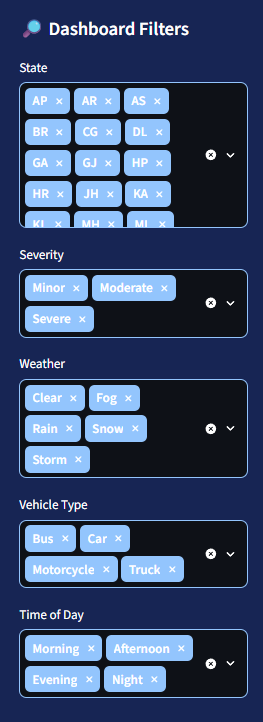

# 🚦 India Road Accident Analysis Dashboard

## 📌 Project Overview

The **India Road Accident Analysis Dashboard** is an interactive data analytics project developed using Python and Streamlit to explore road accident data in India for 2022–2023.

The project focuses on analyzing accident patterns, identifying trends, and understanding how factors such as accident severity, weather conditions, lighting conditions, location, and time may relate to road accidents.

The dashboard transforms raw accident data into meaningful visual insights, helping users explore accident trends and better understand road safety patterns across different regions and conditions.


## 📸 Dashboard Preview

### Main Dashboard


### Filters




## 🎯 Project Objectives

* Analyze road accident data from India for 2022–2023.
* Identify accident trends across states and regions.
* Explore accident severity and its distribution.
* Examine accident patterns by time and lighting conditions.
* Understand the relationship between weather conditions and accident occurrences.
* Present key findings through interactive charts, metrics, and visualizations.
* Build an easy-to-use dashboard for exploring road accident data.

## 🛠️ Technologies Used

* **Python** – Data analysis and dashboard development.
* **Pandas** – Data cleaning, manipulation, and analysis.
* **Plotly** – Interactive data visualizations.
* **Streamlit** – Interactive web dashboard.
* **HTML & CSS** – Custom styling and dashboard appearance.
* **VS Code** – Development environment.

## 📂 Project Structure

```text
INDIA_ROAD_ACCIDENT_ANALYSIS/
│
├── data/
│   ├── accident_data.csv
│   └── accident_data_cleaned.csv
│
├── outputs/
│   └── analysis_summary.txt
│
├── accident_analysis.py
├── accident_dashboard.py
└── README.md
```


## 📊 Key Analysis Areas

### 1. Accident Overview

* Overall accident records and key summary metrics.
* Accident distribution across available categories.
* High-level overview of the dataset.

### 2. State-Wise Analysis

* Comparison of accident records across states.
* Identification of regions with higher accident counts.
* Exploration of geographical patterns in the dataset.

### 3. Accident Severity Analysis

* Distribution of accidents by severity.
* Comparison of severity categories.
* Exploration of accident severity patterns.

### 4. Time-Based Analysis

* Analysis of accident occurrences by hour.
* Identification of periods with higher accident frequency.
* Exploration of temporal accident patterns.

### 5. Weather and Lighting Conditions

* Accident distribution under different weather conditions.
* Analysis of lighting conditions, including daylight and low-light situations where available.
* Comparison of accident patterns across environmental conditions.

### 6. Interactive Data Exploration

* Interactive charts for exploring accident data.
* Filters and visual controls, where available.
* A customized dashboard interface for easier interpretation.

## 🔄 Project Workflow

1. **Data Collection:** Obtain the India road accident dataset covering 2022–2023.
2. **Data Preparation:** Load the dataset and select relevant columns for analysis.
3. **Data Cleaning:** Handle missing values, inconsistent entries, and data formatting issues as required.
4. **Exploratory Data Analysis:** Examine distributions, patterns, and trends using Pandas.
5. **Data Visualization:** Create interactive charts using Plotly.
6. **Dashboard Development:** Integrate the analysis and visualizations into Streamlit.
7. **UI Customization:** Apply custom CSS styling to improve the dashboard's appearance and usability.
8. **Insight Generation:** Interpret the results to highlight meaningful road accident patterns.

## 📈 Key Outcomes

* Developed an interactive dashboard for exploring Indian road accident data.
* Converted raw data into accessible visual insights.
* Enabled comparisons across geographical, temporal, and environmental factors.
* Practiced real-world data cleaning, exploratory data analysis, and visualization.
* Built a data analytics application using Python and Streamlit.

## 🚀 How to Run the Project

### Prerequisites

* Python installed on your system.
* Visual Studio Code or another Python-compatible editor.
* Required Python libraries.

### Installation

**1. Clone the repository**

```bash
git clone https://github.com/parulgiri11/Road_Accident_Analysis_Dashboard
```

**2. Navigate to the project folder**

```bash
cd India_Road_Accident_Analysis
```

**3. Install the required libraries**

```bash
pip install pandas numpy plotly streamlit
```

**4. Launch the dashboard**

```bash
streamlit run accident_dashboard.py
```

**5. Open the dashboard**

Streamlit will provide a local URL in the terminal, usually:

```text
http://localhost:8501
```

Open the URL in your browser to explore the dashboard.

## 📁 Dataset

The project uses an India Car Accident Analysis dataset covering **2022–2023**, sourced from Kaggle.

The analysis uses a selected subset of relevant fields to make the data manageable and focus on meaningful analytical questions.

The fields may include state, accident severity, weekday, time, weather, lighting conditions, and other available accident-related attributes.

*Dataset attribution and the original source link should be added here before publishing the repository.*

## 🔍 Project Scope

This project is focused exclusively on **Data Analytics and Exploratory Data Analysis (EDA)**.

It does not include machine learning model training, predictive modeling, or accident prediction. The purpose is to explore historical data, identify patterns, and communicate findings through interactive visualizations.

## 👩‍💻 Author

**Parul Giri**

M.Tech in Computer Science | Aspiring Data Analyst

Interested in Python, SQL, Excel, Power BI, data visualization, and exploratory data analysis.

* **GitHub:** (https://github.com/parulgiri11)
* **LinkedIn:** (https://www.linkedin.com/in/parul-giri/)

## ⭐ Feedback

If you find this project useful, consider giving the repository a star ⭐.

Suggestions and feedback are welcome!

---

*Built as part of my Data Analytics portfolio to demonstrate practical skills in Python, data analysis, and interactive dashboard development.*
